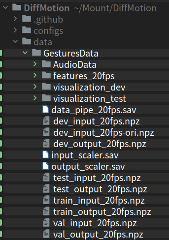

# DiffMotion
DiffMotion: Speech-Driven Gesture Synthesis Using Denoising Diffusion Model [Springer link](https://link.springer.com/chapter/10.1007/978-3-031-27077-2_18) or [Arxiv link](https://arxiv.org/pdf/2301.10047.pdf)
[Website](https://zf223669.github.io/DiffMotionWebsite/)
# Abstract
Speech-driven gesture synthesis is a field of growing interest in virtual human creation. However, a critical challenge is the inherent intricate one-to-many mapping between speech and gestures. Previous studies have explored and achieved significant progress with generative models. Notwithstanding, most synthetic gestures are still vastly less natural. This paper presents DiffMotion, a novel speech driven gesture synthesis architecture based on diffusion models. The model comprises an autoregressive temporal encoder and a denoising diffusion probability Module. The encoder extracts the temporal context of the speech input and historical gestures. The diffusion module learns a parameterized Markov chain to gradually convert a simple distribution into a complex distribution and generates the gestures according to the accompanied speech. Compared with baselines, objective and subjective evaluations confirm that our approach can produce natural and diverse gesticulation and demonstrate the benefits of diffusion-based models on speech-driven gesture synthesis.
## Environment
python=3.10.5 pytorch=1.13 pytorch-lighting=1.6.5 hydra-core=1.2.0 CUDAtoolkit=11.7  
** We use [Lightning-Hydra-Template](https://github.com/ashleve/lightning-hydra-template) for combining the [pytorchLightning](https://www.pytorchlightning.ai/) and [Hydra](https://hydra.cc/).  
** Our model architecture is inspirited by the [Pytorch-ts](https://github.com/zalandoresearch/pytorch-ts)  
hardware: Geforce RTX 3090

### Clone and download the code
'git clone https://github.com/zf223669/DiffMotion.git' 
### Setting conda environment
`conda create -n DiffusionGestureGeneration python=3.10.5`

1: open the project in PyCharm IDE  
2: Setting the project env to DiffusionGestureGeneration
3: Install the packages listed in requirements.txt (you could do this in PyCharm or execute this command in cmd:  
`pip install -r requirements.txt` )
4: Set pymo folder as sources root. The folder icon will become blue.

## Data Prepare
1: We used the [Trinity Speech-Gesture Dataset](https://trinityspeechgesture.scss.tcd.ie/) to train our DiffMotion models.  
2: We follow the data preparing process by [StyleGestures](https://github.com/simonalexanderson/StyleGestures).  
3: After preparing process done, we could get the datas in folder ./StyleGestures/data/GENEA/processed.  
4: Copy all the folder and files in the processed folder to our project folder ./data/GesturesData. (need to create manually the GesturesData folder,like this:  
 

## Training
### with default parameters setting:
`python train_gesture_generation.py`  
The trained model and the predicted bvh files will be saved in folder:  
./logs/gesture_generation/runs/yyyy-mm-day-hour-minute


### train by multirun
For example, we want to train the model by different parameters setting , we could execute the command below(you could list any parameters which are defined in *.yaml  and set them with any value you want):  
`python train_gesture_generation.py --multirun model.train_net.diff_steps=100,500 datamodule.dropout=0,0.2,0.4,0.6`  
reference: https://github.com/ashleve/lightning-hydra-template  
The model and the predicted bvh files will be stored in folder:  
./logs/gesture_generation/multiruns/yyyy-mm-day-hour-minute, respectively.


## BibTeX

```bibtex
@inproceedings{zhang2023diffmotion,
  title={DiffMotion: Speech-Driven Gesture Synthesis Using Denoising Diffusion Model},
  author={Zhang, Fan and Ji, Naye and Gao, Fuxing and Li, Yongping},
  booktitle={MultiMedia Modeling: 29th International Conference, MMM 2023, Bergen, Norway, January 9--12, 2023, Proceedings, Part I},
  pages={231--242},
  year={2023},
  organization={Springer}
}
```
